# 株式ウォッチリスト管理CLI 実装記録

## 📋 プロジェクト概要
- **目標期間**: 1ヶ月（4週間）
- **開発方針**: シンプルなCLIから段階的に機能拡張
- **最終目標**: Google Sheets連携まで含めた完全版

## 📅 開発フェーズ

```mermaid
gantt
    title 株式ウォッチリスト管理CLI 開発スケジュール
    dateFormat  YYYY-MM-DD
    section Phase 1: 基盤構築
    プロジェクト構造作成     :done, p1-1, 2025-07-31, 2d
    基本CLIフレームワーク    :done, p1-2, after p1-1, 2d
    ファイル読み込み機能     :done, p1-3, after p1-2, 3d
    
    section Phase 2: パーサー実装
    TradingViewパーサー      :done, p2-1, after p1-3, 3d
    SeekingAlphaパーサー     :done, p2-2, after p2-1, 4d
    データモデル統合        :done, p2-3, after p2-2, 2d
    
    section Phase 3: 変換機能
    フォーマット変換器       :done, p3-1, after p2-3, 3d
    基本変換コマンド        :done, p3-2, after p3-1, 2d
    テスト・デバッグ        :done, p3-3, after p3-2, 2d
    
    section Phase 4: Google Sheets連携
    OAuth認証システム       :done, p4-1, after p3-3, 3d
    Sheetsクライアント      :done, p4-2, after p4-1, 3d
    データ同期機能          :done, p4-3, after p4-2, 3d
    最終テスト・調整        :done, p4-4, after p4-3, 2d
```



## 🏗️ Phase 1: 基盤構築（Week 1: 1-7日目）

### タスク 1.1: プロジェクト構造作成（1-2日目）
**実績**: 基本的なディレクトリ構造とパッケージ設定を完成

**実装内容**:
- src/ディレクトリ構造の作成
- pyproject.toml でのプロジェクト設定・依存関係管理
- uv仮想環境のセットアップ
- 基本的な設定ファイル（config.yaml）の作成
- ログ設定の実装

**完了条件**:
```
✅ src/配下の全ディレクトリが作成されている
✅ pyproject.tomlに必要なライブラリと設定が記載されている
✅ uv仮想環境が正しく作成・アクティベートされる
✅ config.yamlで基本設定が管理できる
✅ ログ出力が適切に動作する
```

**Git ブランチ**: `feature/phase1-structure`

### タスク 1.2: 基本CLIフレームワーク（3-4日目）
**実績**: Clickベースの基本CLIインターフェースを実装

**実装内容**:
- main.py でのCLIエントリーポイント作成
- 基本コマンド構造（convert, sheets, analyze）の骨組み
- ヘルプメッセージとバージョン表示
- 設定ファイル読み込み機能

**完了条件**:
```
✅ `stock-cli --help` でヘルプが表示される
✅ `stock-cli --version` でバージョンが表示される
✅ convert, sheets, analyze コマンドの骨組みが動作する
✅ 設定ファイルが正しく読み込まれる
```

**Git ブランチ**: `feature/phase1-cli`

### タスク 1.3: ファイル読み込み機能（5-7日目）
**実績**: 各種ファイル形式の基本読み込み機能

**実装内容**:
- ファイル存在チェック・エンコーディング検出
- TXT, CSV, XLSX ファイルの基本読み込み
- エラーハンドリングとログ出力
- ファイル形式自動判定機能

**完了条件**:
```
✅ サンプルファイル（US_STOCK_012ed.txt）が正しく読み込める
✅ Excelファイル（UsStock 2025-07-30.xlsx）が正しく読み込める
✅ 存在しないファイルで適切なエラーメッセージが表示される
✅ 文字エンコーディングが自動検出される
```

**Git ブランチ**: `feature/phase1-fileio`

## 🔧 Phase 2: パーサー実装（Week 2: 8-16日目）

### タスク 2.1: TradingViewパーサー（8-10日目）
**実績**: TradingViewテキストファイルの完全解析

**実装内容**:
- セクション区切り（###SECTION）の解析
- 取引所プレフィックス（NASDAQ:, NYSE:等）の処理
- 特殊シンボル（BRK.B等）の対応
- 統計情報の生成（銘柄数、取引所別分布）

**完了条件**:
```
✅ US_STOCK_012ed.txtから36銘柄が正しく抽出される
✅ セクション情報（###SECTION 1, ###SECTION 2）が保持される
✅ 取引所別統計（NASDAQ: 22, NYSE: 13, AMEX: 1）が正確
✅ BRK.Bなどの特殊シンボルが正しく処理される
```

**Git ブランチ**: `feature/phase2-tradingview`

### タスク 2.2: SeekingAlphaパーサー（11-14日目）
**実績**: 4シート構成Excelファイルの完全解析

**実装内容**:
- Summary, Ratings, Holdings, Dividends シートの解析
- 各シートのデータ統合処理
- 空値・無効値（"-"）の適切な処理
- レーティング・配当データの構造化

**完了条件**:
```
✅ 4つのシート（Summary, Ratings, Holdings, Dividends）が正しく読み込める
✅ 各銘柄のデータが4シートから統合される
✅ "-"や空値が適切にNoneに変換される
✅ レーティング（A+, B-, F等）が正しく保持される
```

**Git ブランチ**: `feature/phase2-seekingalpha`

### タスク 2.3: データモデル統合（15-16日目）
**実績**: 統一されたデータモデルでの管理

**実装内容**:
- Pydanticベースのデータモデル完成
- プラットフォーム間のデータマッピング
- バリデーション機能の実装
- データ正規化処理

**完了条件**:
```
✅ StockData, TradingViewData, SeekingAlphaDataモデルが動作する
✅ データバリデーションが適切に機能する
✅ プラットフォーム間でのデータ変換が可能
✅ 不正なデータで適切なエラーが発生する
```

**Git ブランチ**: `feature/phase2-models`

## 🔄 Phase 3: 変換機能（Week 3: 17-23日目）

### タスク 3.1: フォーマット変換器（17-19日目）
**実績**: プラットフォーム間のデータ変換機能

**実装内容**:
- TradingView ↔ SeekingAlpha 変換
- セクション情報の保持・変換
- 取引所プレフィックスの適切な処理
- データ損失のない双方向変換

**完了条件**:
```
✅ TradingView → SeekingAlpha CSV変換が動作する
✅ SeekingAlpha → TradingView変換が動作する
✅ セクション情報が適切に保持される
✅ 往復変換でデータ損失がない
```

**Git ブランチ**: `feature/phase3-converter`

### タスク 3.2: 基本変換コマンド（20-21日目）
**実績**: CLIでの変換コマンド実装

**実装内容**:
- convert コマンドの完全実装
- --from, --to, --input, --output オプション
- セクション関連オプション（--preserve-sections等）
- バッチ処理対応

**完了条件**:
```
✅ `stock-cli convert --from tradingview --to seekingalpha` が動作する
✅ `stock-cli convert --from seekingalpha --to tradingview` が動作する
✅ --preserve-sections オプションが機能する
✅ 複数ファイルの一括変換が可能
```

**Git ブランチ**: `feature/phase3-commands`

### タスク 3.3: テスト・デバッグ（22-23日目）
**実績**: 変換機能の品質保証

**実装内容**:
- 実際のサンプルファイルでのテスト
- エラーケースの処理確認
- パフォーマンステスト
- ドキュメント更新

**完了条件**:
```
✅ 全ての変換パターンでテストが通る
✅ エラーケースで適切なメッセージが表示される
✅ 大容量ファイルでも適切な処理時間（※ベストエフォート）
✅ README.mdが更新されている
```

**Git ブランチ**: `feature/phase3-testing`

## ☁️ Phase 4: Google Sheets連携（Week 4: 24-30日目）

### タスク 4.1: OAuth認証システム（24-26日目）
**実績**: Google Sheets APIの認証機能

**実装内容**:
- OAuth2.0フローの実装
- 認証情報の安全な保存・管理（`~/dot.hiroshi-project-2025.client_secret.json`を使用）
- .envファイルでの認証ファイルパス管理
- トークン更新の自動化
- 認証エラーの適切な処理

**完了条件**:
```
✅ .envファイルで認証ファイルパスが管理される
✅ `stock-cli auth setup` で初回認証が完了する
✅ token.jsonが自動生成・更新される
✅ 認証エラー時に再認証が促される
✅ 認証情報が安全に保存される（プロジェクト外のファイルを使用）
```

**Git ブランチ**: `feature/phase4-auth`

### タスク 4.2: Sheetsクライアント（27-29日目）
**実績**: Google Sheetsとの基本操作

**実装内容**:
- スプレッドシート作成・読み書き
- シート構造の自動設定
- バッチ更新による効率化
- エラー処理とリトライ機能

**完了条件**:
```
✅ `stock-cli sheets create` で新規シートが作成される
✅ 適切なヘッダー行が自動設定される
✅ 大量データの効率的な書き込みが可能
✅ API制限エラーで適切なリトライが実行される（※ベストエフォート）
```

**Git ブランチ**: `feature/phase4-client`

### タスク 4.3: データ同期機能（30日目）
**実績**: 完全なデータ同期システム

**実装内容**:
- インポート・エクスポート機能
- データの差分更新
- 同期状態の管理
- 最終統合テスト

**完了条件**:
```
✅ `stock-cli sheets import` でファイルからシートに取り込める
✅ `stock-cli sheets export` でシートからファイルに出力できる
✅ 差分更新で効率的な同期が可能（※基本的な書き込み機能として実装）
✅ 全機能の統合テストが通る
```

**Git ブランチ**: `feature/phase4-sync`

## 🧪 テスト戦略

### 単体テスト
- **パーサーテスト**: 各ファイル形式の解析精度
- **データモデルテスト**: バリデーション機能
- **変換機能テスト**: データ変換の正確性
- **認証テスト**: OAuth フローの動作確認

### 統合テスト
- **エンドツーエンドテスト**: 実際のファイルを使用した全体フロー
- **Google Sheets連携テスト**: API操作の動作確認
- **エラーハンドリングテスト**: 異常系の処理確認

### テストデータ
- **実データ**: US_STOCK_012ed.txt, UsStock 2025-07-30.xlsx
- **エッジケース**: 空ファイル、不正形式、大容量ファイル
- **モックデータ**: Google Sheets API のテスト用

### テスト実行
```bash
# 単体テスト
pytest tests/unit/ -v

# 統合テスト
pytest tests/integration/ -v

# カバレッジ測定
pytest --cov=src tests/

# 全テスト実行
pytest tests/ -v --cov=src
```

## 🎯 マイルストーン

| マイルストーン | 期限 | 成果物 | ブランチ |
|---------------|------|--------|----------|
| **MVP完成** | 7日目 | 基本的なファイル読み込みとCLI | `develop` |
| **パーサー完成** | 16日目 | TradingView・SeekingAlpha完全対応 | `develop` |
| **変換機能完成** | 23日目 | プラットフォーム間変換の完全実装 | `develop` |
| **完全版リリース** | 30日目 | Google Sheets連携を含む全機能 | `main` |

## 🔧 技術スタック

### pyproject.toml 設定
```toml
[project]
name = "stock-watchlist-cli"
version = "0.1.0"
description = "株式ウォッチリスト管理CLI - TradingView、Seeking Alpha、Google Sheets間のデータ変換ツール"
authors = [{name = "Developer", email = "dev@example.com"}]
readme = "README.md"
requires-python = ">=3.8"
dependencies = [
    # CLI・設定管理
    "click>=8.0.0",
    "pydantic>=1.10.0",
    "PyYAML>=6.0",
    # データ処理
    "pandas>=1.5.0",
    "openpyxl>=3.0.0",
    "chardet>=5.0.0",
    # Google Sheets連携
    "gspread>=5.7.0",
    "google-auth>=2.15.0",
    "google-auth-oauthlib>=0.8.0",
    "google-auth-httplib2>=0.1.0",
    # 環境変数管理
    "python-dotenv>=1.0.0",
]

[project.optional-dependencies]
dev = [
    # テスト
    "pytest>=7.0.0",
    "pytest-cov>=4.0.0",
    "pytest-mock>=3.10.0",
    # コード品質
    "black>=22.0.0",
    "flake8>=5.0.0",
    "mypy>=1.0.0",
    # 型スタブ
    "types-PyYAML",
    "pandas-stubs",
]

[project.scripts]
stock-cli = "src.main:cli"

[build-system]
requires = ["hatchling"]
build-backend = "hatchling.build"

[tool.black]
line-length = 88
target-version = ['py38']

[tool.mypy]
python_version = "3.8"
warn_return_any = true
warn_unused_configs = true
disallow_untyped_defs = true

[tool.pytest.ini_options]
testpaths = ["tests"]
python_files = ["test_*.py"]
python_classes = ["Test*"]
python_functions = ["test_*"]
addopts = "-v --cov=src --cov-report=html --cov-report=term-missing"
```

### uv環境管理
```bash
# プロジェクト初期化
uv init stock-watchlist-cli
cd stock-watchlist-cli

# 仮想環境作成・アクティベート
uv venv
source .venv/bin/activate  # Linux/macOS
# または .venv\Scripts\activate  # Windows

# 依存関係インストール
uv pip install -e .

# 開発依存関係インストール
uv pip install -e ".[dev]"

# 依存関係更新
uv pip compile pyproject.toml
```

## 🚀 開発環境セットアップ

### 初期セットアップ手順
```bash
# 1. uvのインストール（未インストールの場合）
curl -LsSf https://astral.sh/uv/install.sh | sh

# 2. プロジェクト初期化
uv init stock-watchlist-cli
cd stock-watchlist-cli

# 3. 仮想環境作成・アクティベート
uv venv
source .venv/bin/activate

# 4. 依存関係インストール
uv pip install -e ".[dev]"

# 5. 環境変数設定
cp .env.example .env
# .envファイルを編集してGoogle認証ファイルパスを設定

# 6. 開発ツール確認
black --version
flake8 --version
mypy --version
pytest --version
```

### Git ブランチ戦略
```
main                           # 安定版（リリース用）
├── develop                   # 開発統合ブランチ
├── feature/phase1-structure  # Phase 1: プロジェクト構造
├── feature/phase1-cli        # Phase 1: CLI フレームワーク
├── feature/phase1-fileio     # Phase 1: ファイル読み込み
├── feature/phase2-tradingview # Phase 2: TradingView パーサー
├── feature/phase2-seekingalpha # Phase 2: SeekingAlpha パーサー
├── feature/phase2-models     # Phase 2: データモデル
├── feature/phase3-converter  # Phase 3: 変換機能
├── feature/phase3-commands   # Phase 3: CLI コマンド
├── feature/phase3-testing    # Phase 3: テスト・デバッグ
├── feature/phase4-auth       # Phase 4: OAuth認証
├── feature/phase4-client     # Phase 4: Sheets クライアント
└── feature/phase4-sync       # Phase 4: データ同期
```

### 開発フロー
1. **環境準備**: uv仮想環境のアクティベート
2. **フィーチャーブランチ作成**: 各タスクごとにfeatureブランチを作成
3. **実装・テスト**: TDD（テスト駆動開発）でコード作成
4. **コード品質チェック**: black, flake8, mypy の実行
5. **テスト実行**: pytest でのテスト確認
6. **developマージ**: プルリクエスト経由でdevelopブランチにマージ
7. **統合テスト**: develop ブランチで統合テスト実行
8. **リリース**: マイルストーン達成時にmainブランチにマージ・タグ付け

### バージョン管理
- **v0.1.0**: MVP完成（Phase 1完了）
- **v0.2.0**: パーサー完成（Phase 2完了）
- **v0.3.0**: 変換機能完成（Phase 3完了）
- **v1.0.0**: 完全版リリース（Phase 4完了）

## 📝 ドキュメント管理

### 必須ドキュメント
- **README.md**: プロジェクト概要・インストール・基本使用法
- **SETUP.md**: 詳細なセットアップガイド（Google認証含む）
- **API.md**: 内部API仕様（開発者向け）
- **CHANGELOG.md**: バージョン履歴・変更点

### 更新タイミング
- **各フェーズ完了時**: 機能追加に伴うドキュメント更新
- **マイルストーン達成時**: 包括的なドキュメント見直し
- **リリース前**: 最終的なドキュメント整備

## 🔍 品質保証

### コード品質基準
- **テストカバレッジ**: 80%以上
- **型ヒント**: 全ての関数・メソッドに型注釈
- **ドキュメント**: 全ての公開関数にdocstring
- **リンター**: flake8, black, mypy の全チェック通過

### パフォーマンス基準
- **ファイル読み込み**: 1000行以下のファイルは1秒以内
- **データ変換**: 100銘柄の変換は5秒以内
- **Google Sheets同期**: 100行の同期は10秒以内

## 🎉 成功指標

### 機能面
- [ ] TradingViewファイルの完全解析（セクション対応）
- [ ] SeekingAlpha 4シートファイルの完全解析
- [ ] プラットフォーム間の双方向変換
- [ ] Google Sheets との完全同期
- [ ] 直感的なCLIインターフェース

### 技術面
- [ ] テストカバレッジ80%以上
- [ ] 全ての型チェック通過
- [ ] パフォーマンス基準達成
- [ ] エラーハンドリングの完備
- [ ] セキュリティ要件の満足

### ユーザビリティ面
- [ ] 5分以内でのセットアップ完了
- [ ] 明確なエラーメッセージ
- [ ] 包括的なヘルプ機能
- [ ] 実用的なサンプル・チュートリアル

---

**開発期間**: 2025年7月31日 - 2025年8月2日